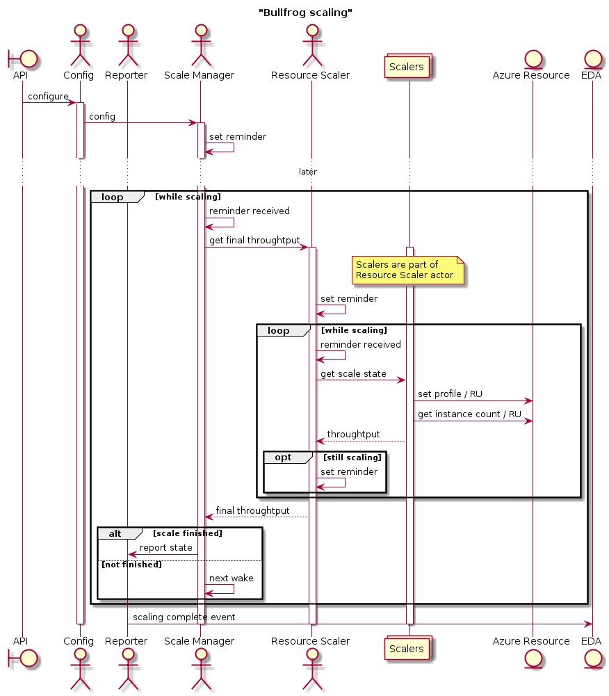

# Bullfrog

A system which allows to schedule events during which specified Azure resources are prescaled to requested levels.

## How does it work
Bullfrog allows to define scale groups. Each scale group controls Azure resources by scaling them in or out based on requested requirements. Currently the scale group can control one virtual machine scale set and a list of Cosmos databases. For each of them scale group defines how to map number of requests to be processed to number of instances in the scale set or RUs in case of CosmosDB.

Scale events can be added to scale groups. Each scale event defines how many requests system should be able to process during specified time frame. The scale events may overlap. The system starts the prescaling of requested resources before the scale event begins to allow the resources to reach their requested levels on time.

## Description
The first step to use Bullfrog is to create a ScaleGroup through the Configurations API endpoint. The ScaleGroup is a set of resources and their configuration which will react to scale events. Sharing of resources among scale groups is not supported. Once issued, the ScaleGroup configuration is saved to the Configuration Manager Actor state (Service Fabric state) and also dispatched to the Scale Manager actor in case there are scale events already scheduled for that ScaleGroup.

The second step is the creation of ScaleEvents which are time intervals with a specified scale amount for each resource in the ScaleGroup. The ScaleEvent is created through the ScaleEvents API endpoint and is dispatched to the ScaleManager. The ScaleManager saves the scheduled event to its Service Fabric state and sets an internal reminder to wake up itself a the specified time.

Once the reminder wakes up the ScaleManager, it will determine the right scale amount for each resource accounting for any overlapping event (i.e.: events that are currently active) and dispatch any additional request to the Resource Scaling Actor.

The Resource Scaling Actor talks to Azure by:
- setting up a new scale profile for VM scalesets
- tweaking the RU value for Cosmos instances
- triggering a runbook for PCI resources

For VM scalesets Bullfrog will determine a scaling event has been completed successfully by checking the VM availability through the corresponding load balancer. Once the average DipAvailability metric is above 95% the resource is considered to be scaled successfully.

For Cosmos instances a successful scaling is determined by checking the actual value of RU for the resources.

Once the target value has been achieved, it is reported back to the ScaleManager which in turns notifies the Reporter Actor.

The Reporter Actor dispatches messages through EDA (Service Bus) on the `bullfrog.domainevents.scalechange` topic. Please see the [Bullfrog EDA events](docs/eda_events.md) chapter for additional info.

## Configuration

See [Configuration](docs/configuration.md) chapter.

## API

See [API](docs/api.md) chapter.

## EDA events

See [EDA Events](docs/eda_events.md) chapter.